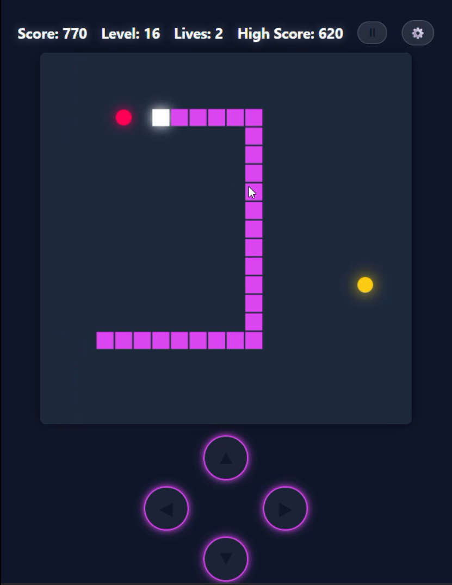

# 🐍 Neon Snake Game

A modern, cyberpunk-themed Snake game built with **TypeScript**, **Vite**, and **HTML5 Canvas**. It features a responsive neon UI, multiple game modes, power-ups, particle effects, and full mobile support.



<div align="center">
  <a href="https://neon-snake-game-gamma.vercel.app/" target="_blank">
    
  </a>
</div>

## 🎮 Features

- **Eight Game Modes**:
  - **Classic**: Traditional snake gameplay with wall wrapping.
  - **Arcade**: Dynamic obstacles spawn and disappear over time, increasing the challenge.
  - **Box**: Closed walls where hitting the boundary results in losing a life.
  - **Gate**: Partial walls with neon-lit segments. The middle sections are open for wrapping, while the corners are deadly.
  - **Mirror**: Controls are reversed (Left becomes Right, Up becomes Down).
  - **Time Attack**: Score as many points as possible in 60 seconds.
  - **Portal**: Teleport between fixed corner portals. Positions interchange every 30 seconds (swapping between Top-Left/Bottom-Right and Bottom-Left/Top-Right) with a 5-second red flash warning.
  - **Zen**: No death from walls or self-collision, and lives are disabled. The game ends when the snake fills the entire grid (400 tiles). Once fully grown, the snake can no longer eat food.

- **Power-up System**:
  - 🔴 **Red Food (Target)**: +10 Score, increases snake length, and contributes to level progression.
  - 🟡 **Yellow Food (Invincibility)**: Grants 10 seconds of invincibility. You can pass through walls, obstacles, and yourself without taking damage. Spawns with a 20% chance after eating red food.
  - 🟢 **Green Food (Extra Life)**: Grants +1 Life. Does not increase snake length. Rare spawn (5% chance, max 2 per level).
  - 🔵 **Blue Food (Slow Motion)**: Temporarily reduces game speed for 10 seconds and adds a subtle blue tint to the background. Spawns with a 15% chance after eating red food.
  - 🟣 **Purple Food (Magnet)**: Automatically attracts nearby food to the snake's head for 5 seconds. Spawns with a 15% chance after eating red food.
  - 🟠 **Orange Food (Shrink)**: Reduces the snake's length by 3 segments (minimum length of 5). Spawns with a 10% chance after eating red food.
  - 🛡️ **Shield**: Provides protection from one collision. Lasts for 1 minute or until consumed. Spawns with a 10% chance after eating red food.

- **Progression**:
  - Level up every 50 points.
  - Game speed increases with every level.
  - In Arcade mode, the number of obstacles increases with the level.

- **Achievement Milestones**:
  - **Bronze Status**: Reaching 25 tiles turns the snake brown/bronze.
  - **Silver Status**: Reaching 50 tiles turns the snake silver.
  - **Golden Snake**: Reaching 75 tiles turns the snake into a glowing golden legend.
  - Each milestone triggers a special on-screen pop-up notification.

- **Visuals & Audio**:
  - **Respawn Protection**: After losing a life, the snake blinks and becomes invincible for 3 seconds.
  - Neon glow effects for the snake and items.
  - Particle explosion effects upon death or taking damage.
  - Synthesized sound effects and background music using the Web Audio API (no external assets required).

  - **Immersive UI**: Full-screen Main Menu, Mode Selection, and Statistics pages with a pulsing "START GAME" button.

- **Statistics & Achievements**:
  - **Persistent Tracking**: Tracks High Scores, Average Scores, and Low Scores for all 8 game modes.
  - **Medal System**: Displays earned Bronze, Silver, and Gold medals in a dedicated Statistics table.
  - **Share Stats**: One-click button to copy a formatted summary of your high scores and achievements to the clipboard.
  - **Global Navigation**: A persistent menu button (top-left) provides instant access to stats and settings.

- **Cross-Platform Controls**:
  - Keyboard support for desktop.
  - Touch swipe and on-screen D-pad for mobile.
  - **Haptic Feedback**: Subtle vibration on mobile control interactions.
  - **Responsive Design**: Optimized layouts for Desktop, Tablet, and Mobile views, including an improved pause menu.

- **Persistence**: 
  - **Game Data**: Detailed statistics (High/Low/Avg) and achievement medals are saved per mode.
  - **Preferences**: User settings (Sound, Music, Vibration, Level Up, Rainbow Skin) are automatically saved to local storage.

## 🕹️ Controls

### Desktop
- **Arrow Keys**: Move Snake (Up, Down, Left, Right)
- **Space / P**: Pause / Resume Game

### Mobile
- **Swipe**: Swipe anywhere on the canvas to change direction.
- **On-Screen D-Pad**: Tap the directional buttons below the game area.

## 🎨 Customization

You can easily customize the game's neon aesthetic by modifying the `COLORS` constant at the top of `src/main.ts`. This allows you to change the theme without digging through the rendering logic:

- **Background**: `COLORS.BACKGROUND` (default: `#1e293b`)
- **Snake**: `COLORS.SNAKE_HEAD` (`#ffffff`) and `COLORS.SNAKE_BODY` (`#d946ef`).
- **Items**: `COLORS.FOOD` (`#ff0055`), `COLORS.POWERUP` (`#facc15`), and `COLORS.LIFE` (`#00ff00`).
- **Obstacles**: `COLORS.OBSTACLE` (`#475569`).

## 📂 Project Structure

```text
snake_game/
├── index.html          # Main entry point and UI structure
├── package.json        # Project dependencies and build scripts
├── tsconfig.json       # TypeScript configuration
├── vite.config.ts      # Vite build tool configuration
├── src/
│   ├── main.ts         # Core game logic, state management, and rendering
│   └── style.css       # Cyberpunk theme, animations, and responsive layout
├── LICENSE             # Project licese
└── readme.md           # Project documentation
```

## 🛠️ Technical Implementation

### Core Logic (`main.ts`)
- **Game Loop**: Managed via `setInterval`, with the interval duration decreasing as the player levels up to increase difficulty.
- **State Management**: The `SnakeGame` class encapsulates all game states, including the snake's coordinates, active power-ups, current score, and lives.
- **Collision Detection**: Every frame, the engine checks the head's position against the food, power-ups, obstacles, and the snake's own body.
- **Coordinate System**: Uses a 20x20 grid system. Movement is calculated by adding/subtracting from X and Y coordinates before multiplying by the tile size for rendering.

### Rendering
- **HTML5 Canvas**: High-performance 2D rendering.
- **Neon Effects**: Achieved using `shadowBlur` and `shadowColor` properties on the Canvas context to create the glowing cyberpunk aesthetic.
- **Particles**: A simple particle system handles the "explosion" effects when the snake takes damage or the game ends.

### Input & Audio
- **Input Handling**: Supports `keydown` events for desktop and `touchstart`/`touchmove` for mobile swipe detection and D-pad interaction.
- **Web Audio API**: Generates sound effects and background music in real-time using oscillators (`sawtooth`, `sine`, `square`). No external audio files are required, keeping the bundle size extremely small.

### Persistence
- **LocalStorage**: Automatically saves and retrieves high scores for all game modes, as well as user preferences for sound and music.

## � Getting Started

### Prerequisites
- **Node.js** (v14 or higher) installed on your machine.

### Installation

1. Navigate to the project folder:
   ```bash
   cd snake_game
   ```
2. Install dependencies:
   ```bash
   npm install
   ```

### Running the Game

Start the development server:
```bash
npm run dev
```
Open your browser and navigate to the URL shown in the terminal (usually `http://localhost:5173`).

### Building for Production

To create a production build (e.g., for Vercel deployment):
```bash
npm run build
```

## 🛠️ Technologies Used

- **Vite**: Fast frontend tooling.
- **TypeScript**: Type-safe logic.
- **HTML5 Canvas**: High-performance rendering.
- **CSS3**: Responsive layout and neon styling.
- **Web Audio API**: Real-time sound synthesis.

## 📄 License

This project is licensed under the MIT License - see the LICENSE file for details.
